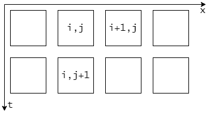

跟随[CFDPython](https://github.com/barbagroup/CFDPython)学习计算流体力学。

### 一维线性传导

波沿着一维空间传导的模型（$c$表示波速）：
$$
\frac{\partial u}{\partial t} + c \frac{\partial u}{\partial x} = 0
$$
怎样理解这个公式？

在一个一维空间内，$u(x,t)$表示在时刻$t$，位置$x$处的性质，不妨理解为温度。随着时间发展，温度逐渐变化；在固定时刻，温度沿着位置也有不同取值。$u(x,t)$代表在时空上的分布。

解微分方程，一定要提供一个初始状态。也就是要求$t=0$，提供在这个条件约束之下，$u(x,0)$的表达式。有了初始状态，我们就可以根据微分方程进行数值推演，计算出整个时空空间中的$u$取值。

计算机只能将模型离散化，取最小时间单元$\Delta t$，最小空间单元$\Delta x$，根据偏导数的定义，可得：
$$
\frac{\partial u}{\partial x} \approx \frac{u(x + \Delta x, t) - u(x, t)}{\Delta x}
$$
对于计算机，可以使用数组`t[]`、`x[]`来代表间隔为$\Delta t$、$\Delta x$的时间空间坐标序列，因此上面的公式转换成计算机离散形式：
$$
\frac{u(x[i+1], t[j]) - u(x[i], t[j])}{\Delta x}
$$
因此原始模型方程就转换成了下面的形式：
$$
\frac{u(x[i], t[j+1]) - u(x[i], t[j])}{\Delta t} + c \frac{u(x[i+1], t[j]) - u(x[i], t[j])}{\Delta x} = 0
$$
`u[i][j]`是二维矩阵，两个下标分别表示空间取值和时间取值。`dt`、`dx`、`c`都是常数，前两个取决于计算精度，后一个取决于模型。如果把公式里涉及到的`u`元素画出来，就是这样：

初始条件给定了`u`的第一行，因此只要逐行计算，就能推导出整个时空空间的u取值。但是这样计算，后一行总会比前一行少一个元素，有效数据会越来越少，右侧越来越短。

这个一维传导模型默认向右传导，因此关于x的偏导应该使用向后差分，也就是：
$$
\frac{u(x[i],t[j]) - u(x[i-1], t[j])}{\Delta x}
$$

$$
\frac{u(x[i], t[j+1]) - u(x[i], t[j])}{\Delta t} + c \frac{u(x[i], t[j]) - u(x[i-1], t[j])}{\Delta x} = 0
$$

$$
u(x[i], t[j+1]) = u(x[i], t[j]) - c \frac{\Delta t}{\Delta x} [u(x[i], t[j]) - u(x[i-1], t[j])]
$$

## CFD核心

流体力学研究过程中，人们使用微分方程对物理世界建模。模型具有不错的精确性，但是使用起来对计算量要求极大。这是因为微分方程没有直观的求解方法，只能发展出若干种数值解法，求近似解。

因此，CFD只是一种应用，核心还是微分方程的数值模拟。对应到流体力学，可能还涉及到可视化，将计算结果以3D动画显示出来。

#### 解方程？

“数值方法”本身就是一个研究领域，为的是解微分方程。但是，模拟一个物理过程，是不是解方程？

物理仿真更像是填充数据$u(x,t)$，找出物理量$u$在时空上的图像（其中空间坐标x可能是三维的），然后再使用动画显示出来。

如果仅仅限于解方程，那么目标就变成了寻找某个未知变量在约束下的取值？微分方程的解是否也能是一种状态。