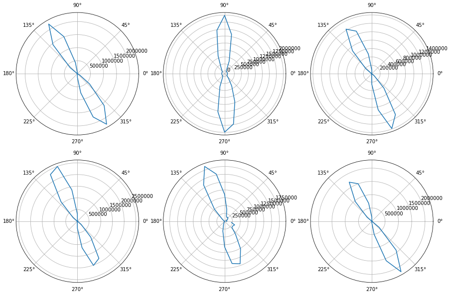
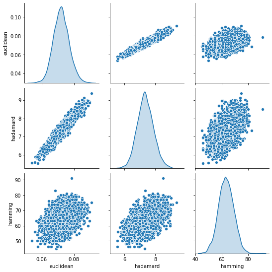
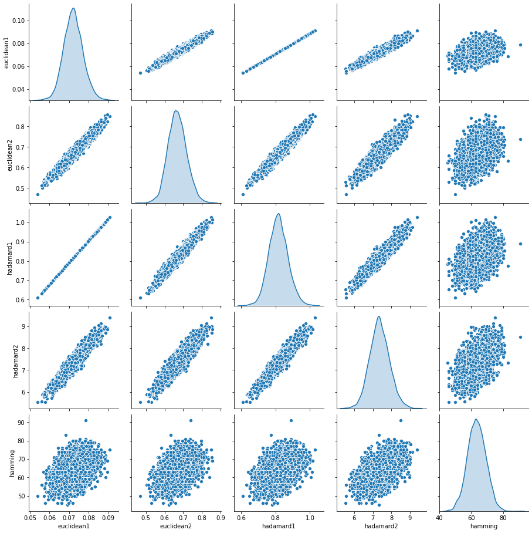
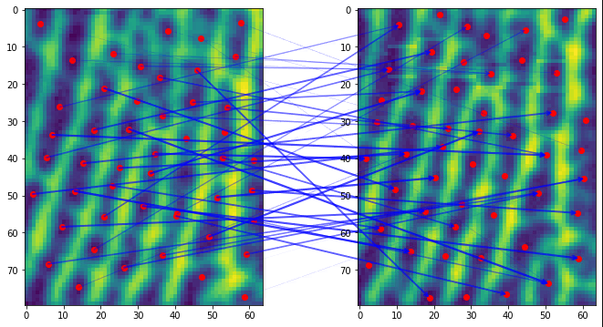
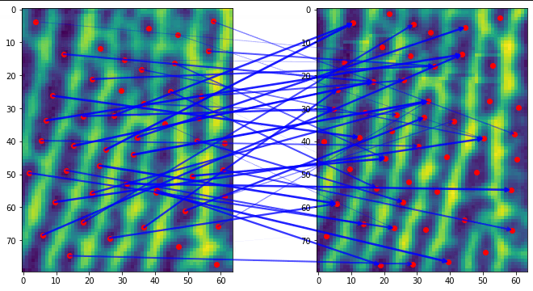

与标准SIFT算法相比，HD的实现有如下特殊之处：

- 只有一个octave，sigma范围1~4
- 假定主方向、辅方向完全对称，只记录一个方向
- 提取128维描述子之后进行hadamard变换并二值化，主方向、辅方向的描述子可相互转换

## 主方向与辅方向

SIFT确定关键点方向使用邻域内梯度直方图，最高峰作为主方向，如果次高峰超过最高峰的80%，则次高峰定位辅方向，否则辅方向不存在。

对于指纹图像中的关键点，普遍存在辅方向，而且主方向、辅方向基本上相差180°。因此在HD代码中，将主方向、辅方向统一对待，角度落在$[0,180°)$之内的方向看作主方向，主方向+180°作为辅方向。



## 描述子转换

SIFT描述子是在关键点周围，统计4x4子方格内部的方向场直方图，子方格已经按照描述子（主）方向对齐，子方格排布如下：

$$
\begin{matrix}
    hist11 & hist12 & hist13 & hist14 \\
    hist21 & hist22 & hist23 & hist24 \\
    hist31 & hist32 & hist33 & hist34 \\
    hist41 & hist42 & hist43 & hist44
\end{matrix}
$$

旋转180°之后，相当于矩阵内元素排列顺序翻转：

$$
\begin{matrix}
    hist44 & hist43 & hist42 & hist41 \\
    hist34 & hist33 & hist32 & hist31 \\
    hist24 & hist23 & hist22 & hist21 \\
    hist14 & hist13 & hist12 & hist11
\end{matrix}
$$

同理，对于一个子方格内部，分为8组统计方向场直方图，关键点方向旋转180°之后，相当于这个直方图循环左移半个周期，`[0..7]`变为`[4..7, 0..3]`。

综合起来，如果得到了主方向的描述子，那么转换成辅方向描述子的方法就是：

```python
def pri_to_aux(desc):
	return desc.reshape((32, 4))[::-1].flatten()
```

## 哈达玛变换

SIFT提取的描述子是128维的浮点向量，比较相似度需要计算欧氏距离，比较耗时，因此HD将描述子二值化，转换成128-bit字段，也就是4个`int32`类型。

二值化分成两步，首先是hadamard变换，然后才是二值化（根据是否大于0判断）。

因此，这里涉及到三种距离：欧氏距离、哈达玛变换残差、汉明距离。随机生成一组原始SIFT描述子，归一化之后进行hadamard变换、二值化，保存不同阶段的中间结果计算距离，检查三种距离的相关性：



与欧氏距离相关性最强的是哈达玛残差，HD使用的汉明距离则相关性较低，优点只剩下计算速度快和占用空间少。

如果考虑到欧氏距离与残差和相关性较强，分别用这两种方法计算原始描述子、哈达玛变换后描述子，结果如下：



因为hadamard变换是正交变换，因此变换前后的欧氏距离严格相等。

## 哈达玛变换与描述子方向

主方向和辅方向描述子在经过哈达玛变换之后，绝对值相等，符号按规律翻转：

```
0x 0ff0f00f f00f0ff0 0ff0f00f f00f0ff0
```

因此，经过哈达玛变换，只需要保存一份描述子，另一个方向的描述子经过变换就能得到。

## 试验：原始描述子替换二值化描述子

`CalculateMap`内部，使用原始描述子计算残差和，替代汉明距离。

汉明距离计算得到的最近邻：



原始描述子残差和得到的最近邻：

