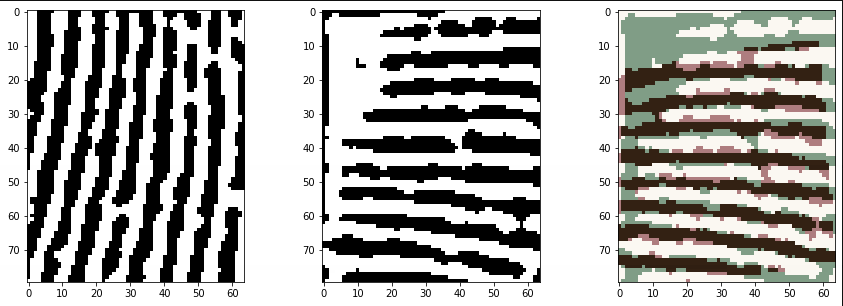
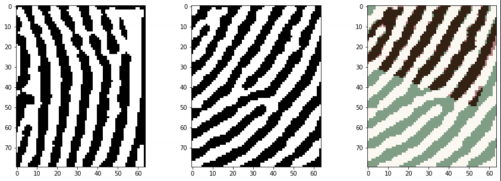
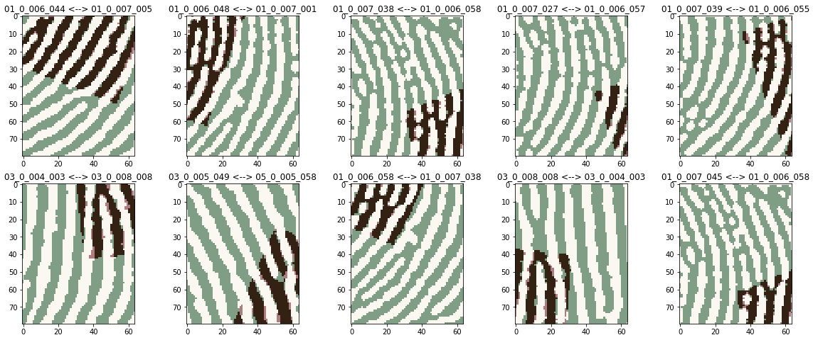

以子模版匹配为基本单元，训练多层神经网络（MLP）

提升精度=降低误识+降低拒识

预测分数最低的正例样本（图库：`7339_mass_A`，模板：`07_0_002_041`，样本：`07_0_002_053`，最可能拒识）：

预测分数最高的反例样本（图库：`7339_mass_A`，模板：`01_0_006_044`，样本：`01_0_007_005`，最可能误识）：

更关键的问题，在于处理容易误识的训练数据。

以下是预测分数最高的10个反例样本：

