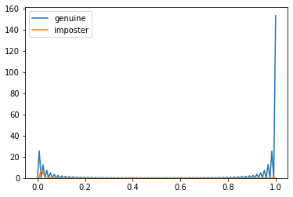
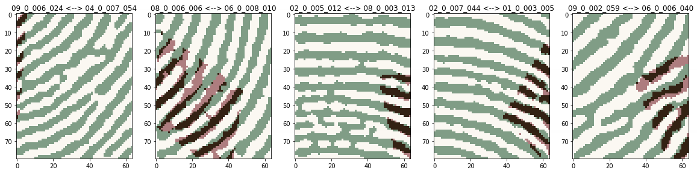
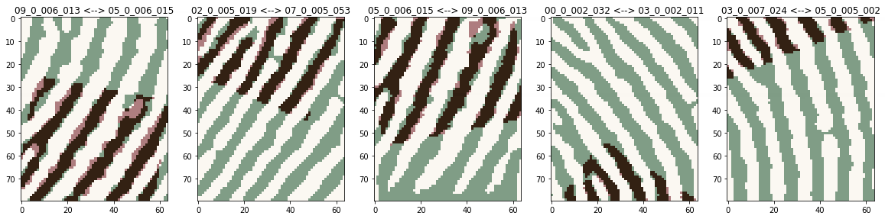
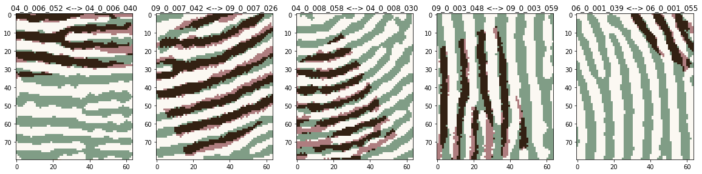
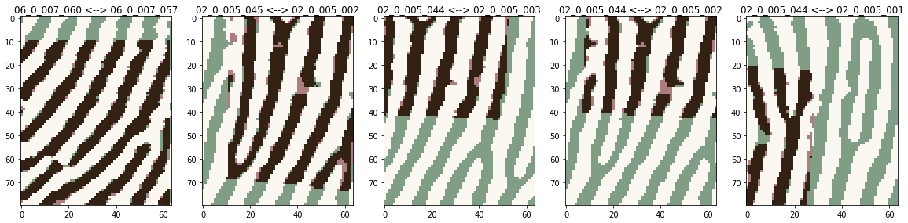

以子模版匹配为基本单元，训练多层神经网络（MLP）

提升精度=降低误识+降低拒识

## 检查匹配情况

预测分数最低的正例样本（图库：`7339_mass_A`，模板：`07_0_002_041`，样本：`07_0_002_053`，最可能拒识）：


预测分数最高的反例样本（图库：`7339_mass_A`，模板：`01_0_006_044`，样本：`01_0_007_005`，最可能误识）：


更关键的问题，在于处理容易误识的训练数据。

以下是预测分数最高的10个反例样本：


正例样本与反例样本的预测分数分布差异：



可以看到，有些正例预测分数很低，反例预测出来分数高的却很少。

## 极端结果

分数最差的5个反例：



**分数最好的五个反例**（误识）：



**分数最差的五个正例**（拒识）：



分数最好的五个正例：



HD总能计算出最接近匹配的仿射关系，因此，仅仅根据重叠部分的simscore也许不足以判别。

## 相似度分数（SimScore）计算

相似度分数是matchinfo中非常重要的字段，判决阶段的重要依据。

已经计算出仿射关系，将两张图片二值化，按照仿射关系重叠在一起，然后统计重叠区域中，各种像素组合的数量：`[00]`、`[01]`、`[10]`、`[11]`。这四个统计量就是原始simscore，然后根据这四个参数，计算黑点相似度、白点相似度、整体相似度。

HD使用阈值对图像进行二值化，得到黑二值图和白二值图，同时黑二值图还有增强的版本，也就是说一共三种二值图。

HD相似度计算过程

```
- FingerFeatureRecognitionMilanF
	- ForwardMatch
		- ImgBwSimilarity
			- ImgBwSim->ImgSimScoreMask
			- ImgBwSim->ImgSimScoreMask
		- 计算结果放在nSimScore、nLhsSimscore
```


