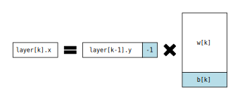
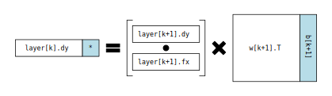

本文推导多层神经网络误差反传和权值更新算法，并给出了一个基于`numpy`的实现。

### 符号系统

为了让后面的推导便于理解，我们首先规定一套符号系统。

误差反传机制主要用于多层神经网络，这类网络的神经元分为若干层，每一层又有若干神经元。我们将网络的所有层组织在数组`layer`中，从下标`0`开始编号，`layer[0]`表示输入层，`layer[1]`表示第一个隐含层，`layer[-1]`表示输出层。

对于第`k`层，数组`layer[k].x`表示该层所有神经元的输入，`layer[k].y`表示该层所有神经元的输出。那么输入和输出之间应该有这样的关系（其中`f`是这个网络使用的转移函数）：

$$ layer[k].y[i] = f(layer[k].x[i]) $$

除输入层外，每一层的输入都是根据前一层所有神经元的输出加权求和而来的：

$$ layer[k].x[i] = \sum_{j=0}^{layer[k-1].len-1} layer[k-1].y[j] * w[k][j,i] - b[k][i] $$

其中`w`是权值矩阵，`b`是偏移。特别地，我们可以将偏移和权值组合起来，如图：

这样就可以将权值和偏移量使用同一个矩阵来表示，每层的矩阵使用数组`w`来保存。输入层不存在权值矩阵，因此数组`w`的下标从`1`开始。

### 权值更新公式

既然是误差反传，首先要给出误差（Error）的定义。在网络训练过程中，每个样本都会提供一个教师信号，记作`t`，这个数组与输出层的输出`layer[-1].y`维度相同。误差`E`的定义如下：

$$ E = \frac{1}{2} \sum_{i=0}^{layer[-1].len-1} (layer[-1].y[i] - t[i])^2 $$

训练的目的就是让这个误差最小化，通过不断修改权值矩阵`w`实现。对于`w`中任意一个元素`w[k][i,j]`，更新公式为（\\(\eta\\)表示学习率）：

$$ w[k][i,j] = w[k][i,j] - \eta \frac{\partial E}{\partial w[k][i,j]} $$

### 递推

因此，关键在于求出误差对于每个权值的偏导数。直接写出偏导数关于教师信号的表达式并不容易，但是可以使用后一层的相关参数来表示。权值`w[k][i,j]`只会影响神经元输入`layer[k].x[j]`，因此误差偏导可以展开：

$$
\begin{aligned}
\frac{\partial E}{\partial w[k][i,j]}
&= \frac{\partial E}{\partial layer[k].x[j]} \frac{\partial layer[k].x[j]}{\partial w[k][i,j]} \\\\
&= \frac{\partial E}{\partial layer[k].x[j]} layer[k-1].y[i] \\\\
&= \frac{\partial E}{\partial layer[k].y[j]} \frac{\partial layer[k].y[j]}{\partial layer[k].x[j]} layer[k-1].y[i] \\\\
&= \frac{\partial E}{\partial layer[k].y[j]} f'(layer[k].x[j]) layer[k-1].y[i]
\end{aligned}
$$

通过上面的推导，我们把误差关于某一个权值的偏导转换成了关于后一层输出的偏导，其余参数均为已知（对于偏移，只需要将`layer[k-1].y[i]`换成`-1`）。因此，关键就变成了如何求解误差`E`关于神经元输出值`layer[k].y[j]`的偏导数。

如果`k==layer.len-1`，说明这是网络中的输出层，利用教师信号，偏导数非常容易计算：

$$ \frac{\partial E}{\partial layer[-1].y[j]} = layer[-1].y[j] - t[j] $$

对于隐层节点，我们同样可以将这个偏导数使用后一层的数据来表示：

$$
\begin{aligned}
\frac{\partial E}{\partial layer[k].y[j]}
&= \sum_{i=0}^{layer[k+1].len-1} \frac{\partial E}{\partial layer[k+1].x[i]} \frac{\partial layer[k+1].x[i]}{\partial layer[k].y[j]} \\\\
&= \sum_{i=0}^{layer[k+1].len-1} \frac{\partial E}{\partial layer[k+1].x[i]} w[k+1][j,i] \\\
&= \sum_{i=0}^{layer[k+1].len-1} \frac{\partial E}{\partial layer[k+1].y[i]} \frac{\partial layer[k+1].y[i]}{\partial layer[k+1].x[i]} w[k+1][j,i] \\\\
&= \sum_{i=0}^{layer[k+1].len-1} \frac{\partial E}{\partial layer[k+1].y[i]} f'(layer[k+1].x[i]) w[k+1][j,i]
\end{aligned}
$$

由于隐层神经元与下一层的所有神经元都有连接，因此误差也会通过后一层的每个神经元传播到输出层。在展开偏导数的时候，也要计算后一层的每一个神经元。

通过上面的推导，我们把误差关于隐层神经元输出`layer[k].y[j]`的偏导转换成了关于后一层神经元输出`layer[k+1].y[*]`的偏导。从输出层入手，我们可以逐层求解出每一层的误差偏导，就像数学归纳法一样。

每一个神经元的计算都需要遍历后一层的所有元素，这种计算非常类似矩阵乘法，因此可以试着将上面的公式转换为矩阵形式。

首先需要为每一层定义一组新的向量`layer[k].dy`，这个向量的形状与`layer[k].y`相同，只是每个元素都是与误差的偏导数：

$$ layer[k].dy[i] = \frac{\partial E}{\partial layer[k].y[i]} $$

类似地，还需要定义向量`layer[k].fx`，每个元素都是神经元输出值经激活函数导函数计算之后的输出：

$$ layer[k].fx[i] = f'(layer[k].x[i]) $$

有了`dy`、`fx`这两个额外的向量，我们可以写出`dy`的层间推导公式（符号$\odot$表示逐位相乘）：

$$
layer[k].dy = (layer[k+1].dy \odot layer[k+1].fx) w[k+1]^T
$$

联系到我们把偏移量放在了矩阵`w[k+1]`中，直接计算会导致输出的向量多一个元素，但这个多出来的元素不会影响我们的计算，直接将其忽略即可，如图：

### 推导过程总结

以上给出了误差反传过程的推导，这个推导过程中，我们没有网络的层数，没有限制激活函数的类型，甚至网络的不同层可以使用不同的激活函数。

而且，正向传播和反向传播都可以表示为矩阵形式，方便使用代码实现。

### 代码实现

下面使用Python实现一个多层神经网络，并根据刚刚推导出来的误差反传公式实现训练。

相关向量均使用行向量，这与很多神经网络的文献都不一致。采用行向量存储与C语言的数组存储方式一致。

~~~ python
class Layer:
    def __init__(self, prev_size, size, f, fd):
        self.w  = np.random.rand(prev_size + 1, size)
        self.f  = np.vectorize(f)
        self.fd = np.vectorize(fd)
    def forward(self, prev_y):
        self.prev_y = np.append(prev_y, [[-1]], axis=1)
        self.x = np.dot(self.prev_y, self.w)
        self.y = self.f(self.x)
        return self.y
    def backward(self, dy):
        self.dy = dy
        self.fx = self.fd(self.x)
        self.prev_dy = np.dot(dy * self.fx, self.w.T)[:, 0:-1]
        return self.prev_dy
    def update(self, eta):
        delta = np.dot(self.prev_y.T, self.dy * self.fx)
        self.w = self.w - delta * eta
~~~

神经网络不应该限制层数，因此我们将每一层抽象出来，使用单独的类表示。函数`forward`表示计算过程，输入前一层的输出，给出本层的输出；函数`backward`是误差反传过程，输入本层的dy，输出前一层的dy。正传和反传过程中，还会把有用的相关变量保存下来。`update`函数会利用之前正传反传过程中积累的数据更新权值。

`Layer`只能表示神经网络中的一层，因此我们需要一个`MLNetwork`类，将各层组织起来：

~~~ python
def sigmoid(x):
    return 1.0 / (1.0 + np.exp(-x))

def dsigmoid(x):
    y = sigmoid(x)
    return y * (1.0 - y)

class BPNet:
def __init__(self, input_size):
        self.input_size  = input_size
        self.output_size = input_size
        self.layers = []
    def add_layer(self, size):
        self.layers.append(Layer(self.output_size, size, sigmoid, dsigmoid))
        self.output_size = size
    def calc(self, x):
        y = x.reshape((1, x.size))  # input layer
        for l in self.layers:
            y = l.forward(y)
        return y
    def train(self, x, t):
        y = x.reshape((1, x.size))  # input layer
        for l in self.layers:
            y = l.forward(y)
        dy = y - t.reshape((1, t.size))
        for l in reversed(self.layers):
            dy = l.backward(dy)
            l.update(0.5)
~~~

其中的重点是`train`函数，也就是训练过程。这个过程与计算有重叠的操作，都要首先进行正向传播，从输入向量逐层传播到输出向量。之后根据网络的输出与教师信号计算得到输出层的误差偏导`dy`，并逐层反向传播，计算每一层的误差偏导`dy`。每一层在计算得到了偏导之后，就可以进行权值更新。
